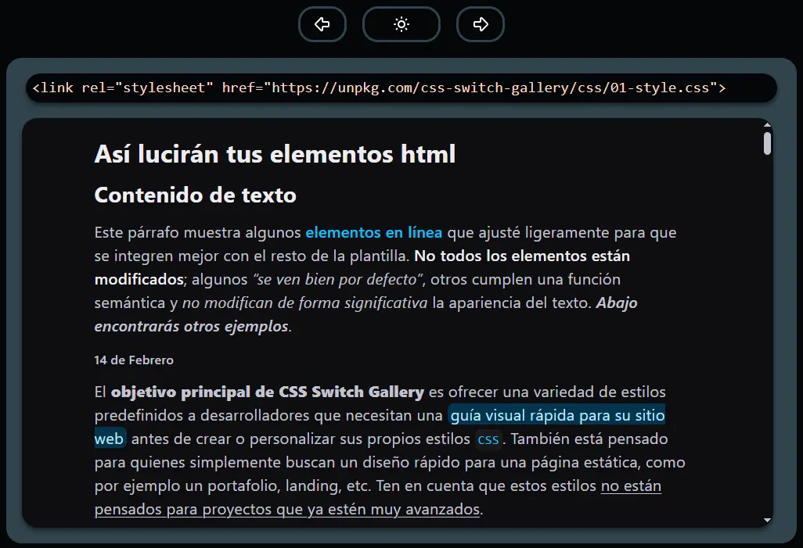

# CSS Switch Gallery

Una página estática donde puedes ver una colección de estilos CSS listos para usar. Los estilos se muestran en tiempo real mediante un visualizador. Con los botones switch, puedes cambiar entre diferentes estilos CSS prediseñados.

## Uso:
Elige el estilo que más te guste utilizando los botones switch del visualizador.
Una vez que encuentres el que mas te gusta, copia y pega el elemento link dentro del head de tu archivo index.html. Con eso, ya podrás usar el estilo.
Cada plantilla representa un estilo único e incluye clases prediseñadas. Puedes aplicarlas directamente, de forma similar a como funciona Tailwind CSS, para dar estructura y diseño a tu página rápidamente.

### Las clases predefinidas permiten:
- Organizar tu página de manera rápida sin que tengas que escribirlas tu mismo, solo debes aplicar las clases.
- Diferenciar visualmente elementos y secciones de la interfaz.
- Cambiar tamaño de imágenes.

*Puedes ver los nombres de las clases desplazándote por el visualizador.*

## Tecnologías utilizadas:
- Vite + React (empaquetador, componentes y hooks)
- Tailwind CSS (estilos reutilizables y optimizados)
- Vercel (deploy)
- Zustand (estado global)
- CSS y HTML (plantillas y demo de elementos)

## Contribución:
Si quieres, puedes enviar tu propia plantilla original.

### A tener en cuenta para enviar la plantilla:
- Por favor, revisa que tu plantilla no se parezca a ninguna que ya exista.
- La plantilla enviada debe estar preparada para un modo claro y un modo oscuro.
- Incluir las variables base utilizadas actualmente en las plantillas existentes.
- Agregar las clases requeridas exactamente como están definidas. Preferentemente, mantener el orden en el que aparecen en el visualizador.
- Cuando tu plantilla esté lista, envía un pull request al repositorio de plantillas CSS. [templates-css](https://github.com/RobertGmzz/templates-css)
- El nombre de la plantilla lo eliges tú. Se recomienda que sea corto.

*También puedes reeditar una plantilla existente, aportando un valor destacable y respetando la idea original*

## Licencia:
El código de la galería está bajo licencia GPL v3.
Las plantillas CSS descargables están bajo licencia MIT.